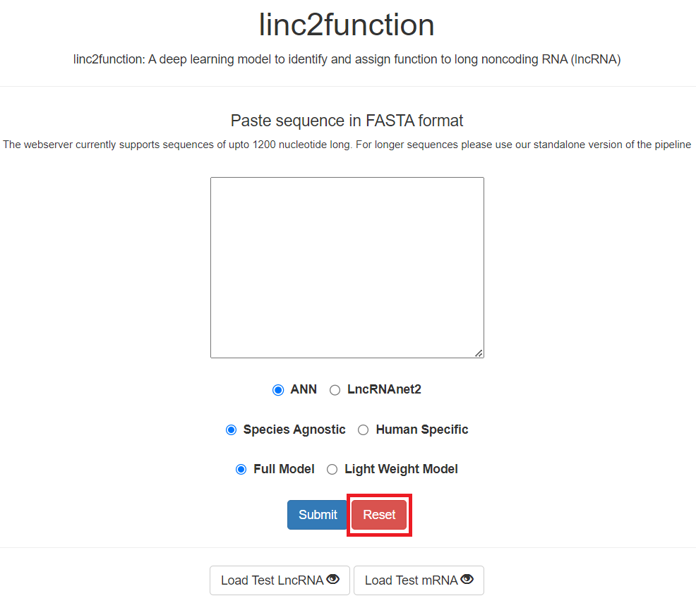
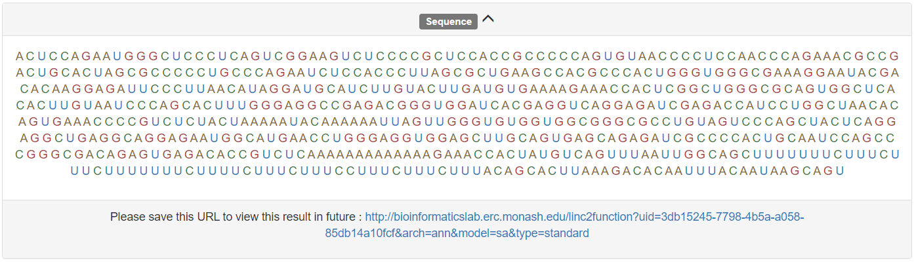

Introduction
------------

Research Abstract
~~~~~~~~~~~~~~~~~

Long Non-coding RNAs (lncRNA) account for about 80% of RNA transcribed in a cell and they perform crucial roles in genome regulation. Multi-omics studies have implicated several lncRNA in human diseases including cancer, based on their unusual expression. However, little is known about their specific roles and mechanisms in a disease etiology. New lncRNA are being predicted but an accurate number of lncRNA in humans is still not known and moreover, a tiny fraction of them have been assigned a function.

Inconsistencies between databases reporting lncRNA in the human genome exist and there is a need for more accurate methods to identify and annotate them. Further, to understand their mechanisms in disease etiology newer predictive computational approaches are required that can provide comprehensive analysis from the identification of sequences to structure and functional mechanisms. We observed that the existing approaches did not take into consideration the secondary structure and their interacting domain characteristics of this RNA, and were also unable to generalize their predictions for disparate species.

We have addressed these challenges in our pipeline called Linc2Function. First, we extracted different features of lncRNA and evaluated them individually to obtain important features with high discriminative ability between a lncRNA and other RNA transcripts. Next, we built an ANN model with selected features to identify lncRNA given only a sequence. Finally, we integrated the identification module to the pipeline along with two other modules that can predict the secondary structure and obtain the interacting structural domains along with partner biomolecules. Our pipeline is the first to report annotation at the structural domain level. Benchmarking results show that Linc2Function can generalize well across species and performs on par with the state of the art methods available. The pipeline is accessible both via a web-interface and as a standalone downloadable tool.

Usage
~~~~~

.. image:: images/initial_sequence.png

.. image:: images/initial_mode.png

.. image:: images/initial_type.png

.. image:: images/initial_submit.PNG

.. image:: images/seq_loaded.PNG

Results
~~~~~~~

.. image:: images/result_transcript_details.PNG

.. image:: images/result_protein_interactome.PNG

.. image:: images/result_rna_interactome.PNG

.. image:: images/result_ss_2d.PNG

