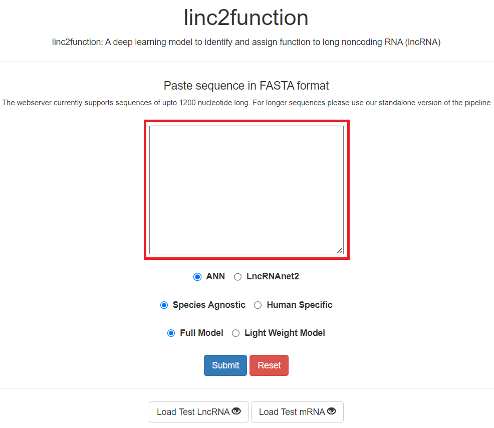
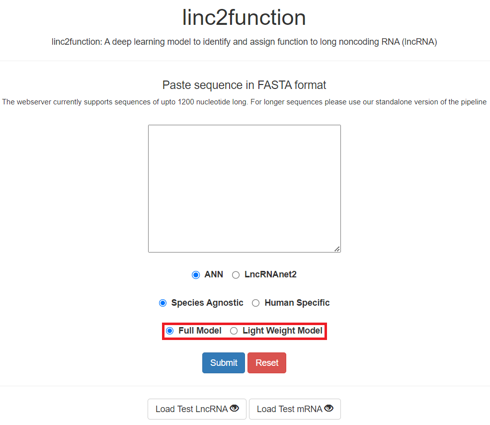
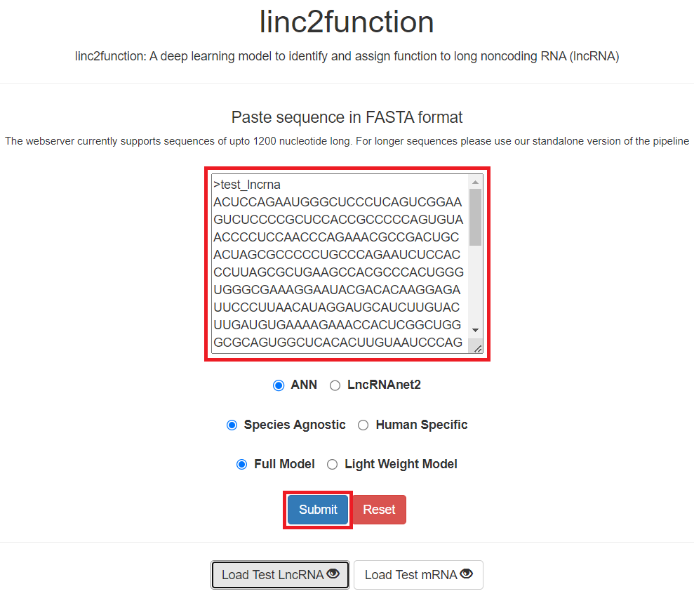
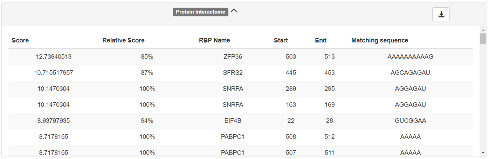
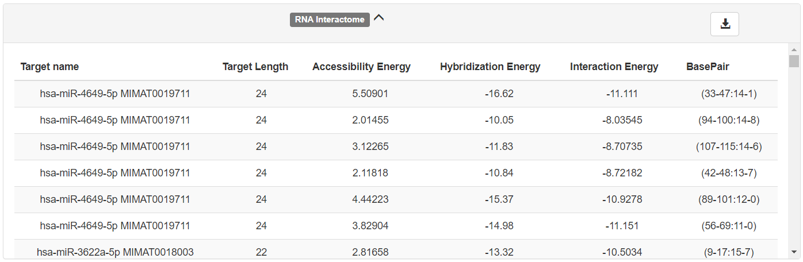

Webpage
-------

A web deployment of this pipeline can be accessed via our group website: https://bioinformaticslab.erc.monash.edu/linc2function

Usage
~~~~~

.. image:: images/initial.png

.. image:: images/initial_architecture.png

.. image:: images/initial_mode.png

.. image:: images/initial_submit.PNG

.. image:: images/initial_reset.PNG

.. image:: images/initial_load.PNG

Results
~~~~~~~

.. image:: images/result_transcript_details.PNG

.. image:: images/result_ss_arc.PNG

.. image:: images/result_ss_2d.PNG

.. image:: images/result_result.PNG

For any feedback or queries please contact: sonika.tyagi@monash.edu
