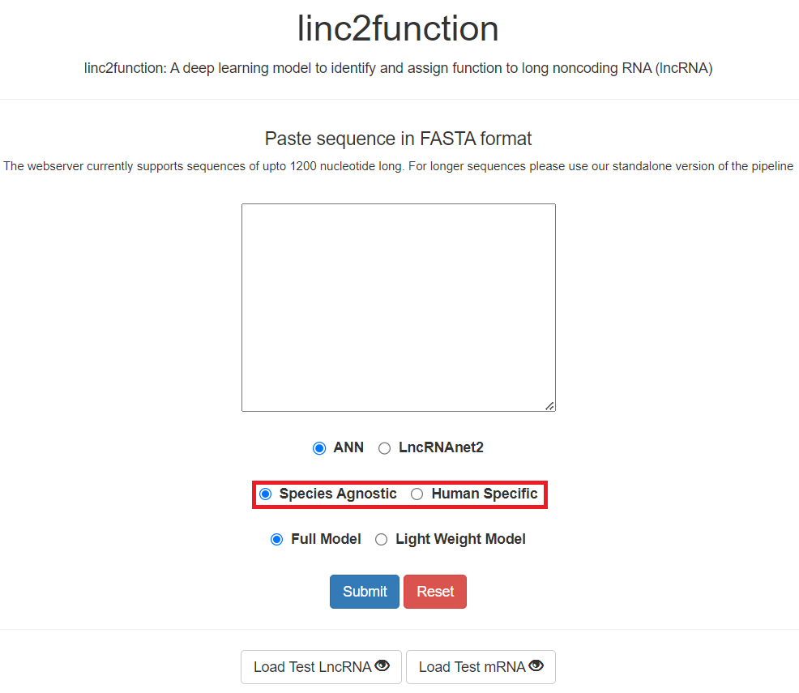
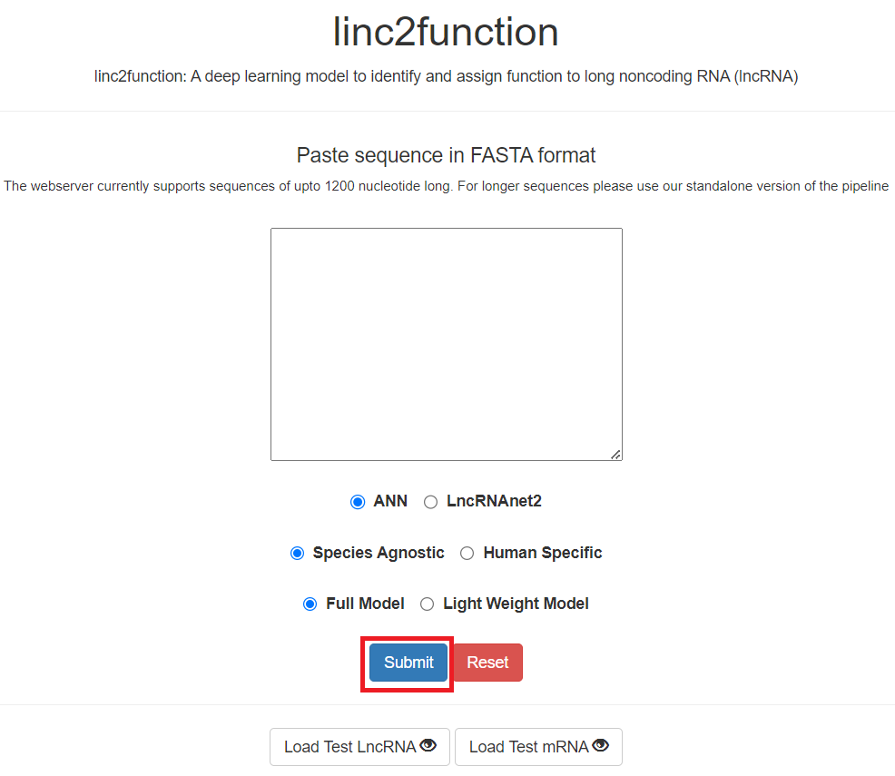
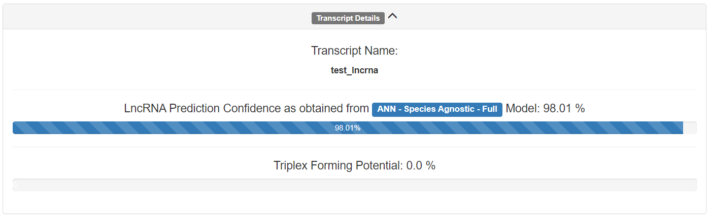
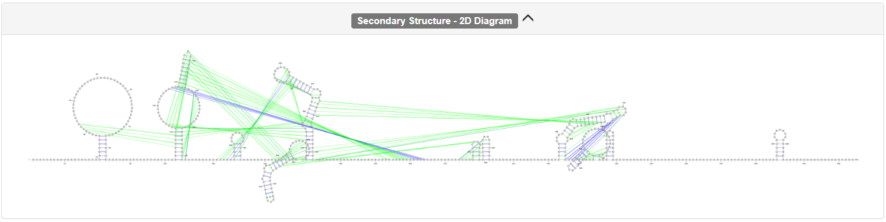

Webpage
-------

A web deployment of this pipeline can be accessed via our group website: https://bioinformaticslab.erc.monash.edu/linc2function

Usage
~~~~~

linc2function
"""""""""""""

After loading the URL, the following page appears;

.. image:: images/initial.png

Sequence
""""""""

This text box (highlighted) allows to paste the transcript sequence in FASTA format under study;

.. image:: images/initial_sequence.png

Architecture
""""""""""""

The fitst set of selection buttons (highlighted) is for selecting the model architecture i.e. Artificial Neural Network (ANN) or Convolutional Neural Network (CNN) labelled as LncRNAnet2;

.. image:: images/initial_architecture.png

Mode
""""

The next set of selection buttons (highlighted) is for selecting either Species Agnostic mode or Human Specific mode;

Type
""""

The final set of selection buttons (highlighted) is for either selecting a basic model (Light Weight Model) or the standard model (Full Model);

.. image:: images/initial_type.png

Submit
""""""

This button (highlighted) is used to submit the page once the sequence is pasted and the selections are made;

Reset
"""""

This button (highlighted) is used to clear the page;

.. image:: images/initial_reset.PNG

Test Data
"""""""""

We also provide option (highlighted) to load the test data to allow users to explore the utility.

.. image:: images/initial_load.PNG

Upon loading the sequence (highlighted) the pipeline can be run by pressing the submit button (highlighted).

.. image:: images/seq_loaded.PNG

Results
~~~~~~~

Transcript Details
""""""""""""""""""

This section provides the transcript name (as obtained from the FASTA data), probability of this sequence being LncRNA as per the selections in the previous page, and its triplex forming potential.

SHAP values
"""""""""""

This section contains the SHapley Additive exPlanations (SHAP) values for the selected model indicating the relative importance of the individual features in model prediction.

Protein Interactome
"""""""""""""""""""

This section lists the predicted Protein Interactome of the transcript, containing the RNA Binding Protein (RBP), scores, binding site seuqence and its coordinates.

.. image:: images/result_protein_interactome.PNG

RNA Interactome
"""""""""""""""

This section lists the predicted RNA Interactome of the transcript, containing the target name, target length, associated energy measurements, and the coordinates of both the transcript and the target.

.. image:: images/result_rna_interactome.PNG

RNA Structure (Arc)
"""""""""""""""""""

This section lists the predicted RNA secondary structure of the transcript as an arc diagram.

.. image:: images/result_ss_arc.PNG

RNA Structure (2D)
"""""""""""""""""""

This section lists the predicted RNA secondary structure of the transcript as a 2D diagram.

RNA Structure (2D)
"""""""""""""""""""

Lastly, the section lists input sequence and an URL for accessing the generated analysis in future.

.. image:: images/result_result.PNG

For any feedback or queries please contact: sonika.tyagi@monash.edu
